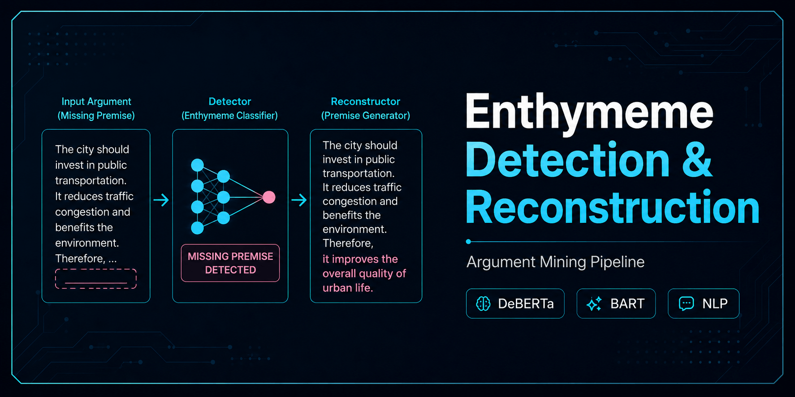

  

 
#!/bin/bash
#SBATCH --job-name=mtg_eval_gap
#SBATCH --output=logs/mtg_eval_gap_%j.out
#SBATCH --error=logs/mtg_eval_gap_%j.err
#SBATCH --time=00:30:00
#SBATCH --partition=gammaweb
#SBATCH --mem=16G
#SBATCH --cpus-per-task=2

echo "============================================================"
echo "MIND THE GAP - GAP-ONLY EVALUATION"
echo "Started: $(date)"
echo "Node   : $(hostname)"
echo "Job ID : ${SLURM_JOB_ID}"
echo "============================================================"

cd /mnt/ceph/storage/data-tmp/2026/zuyi6708/argsme-project

source /mnt/ceph/storage/data-tmp/2026/zuyi6708/enthymeme_detection/venv_final_2026/bin/activate

python3 scripts/evaluate_gap_only.py

echo "============================================================"
echo "Completed: $(date)"
echo "============================================================"
